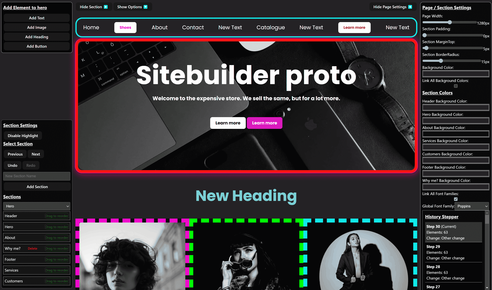

# Sitebuilder Prototype Snapshot

## Low dependency client side only

A `proof of concept prototype` for a client side only site builder.

`Builds into 395kb, 121kb gzipped.`

I included a basic useable UI for it. UX is "not the strongest" if you are not me.. Let's call it MyX.

## Dependencies
    "dexie": "^4.0.11",
    "react": "^19.0.0",
    "react-colorful": "^5.6.1",
    "react-dnd": "^16.0.1",
    "react-dnd-html5-backend": "^16.0.1",
    "react-dom": "^19.0.0"
    -colorful can be removed just tested it

## Features
- Fully client side
- IndexedDB for storing templates and app state using Dexie
- Can save and load templates
- React DnD for drag and drop
- React Context for theme and state management
- Has templates 2 basic templates
- A Bin to restore
- Bunch of basic setting
- A half decent close UI
- Undo redo
- Can add extra sections
- Can add text, image, heading, button elements
- Handles images as base64 strings -->

## Note
- Felt emo, might continue. Somewhere in the middle of refactoring elements and sections.
- Will continue if Gemini won't be able to single shot it in six months.
- Was good do dork around with React after years. Gets too much hate for no reason. Single devX is great.

